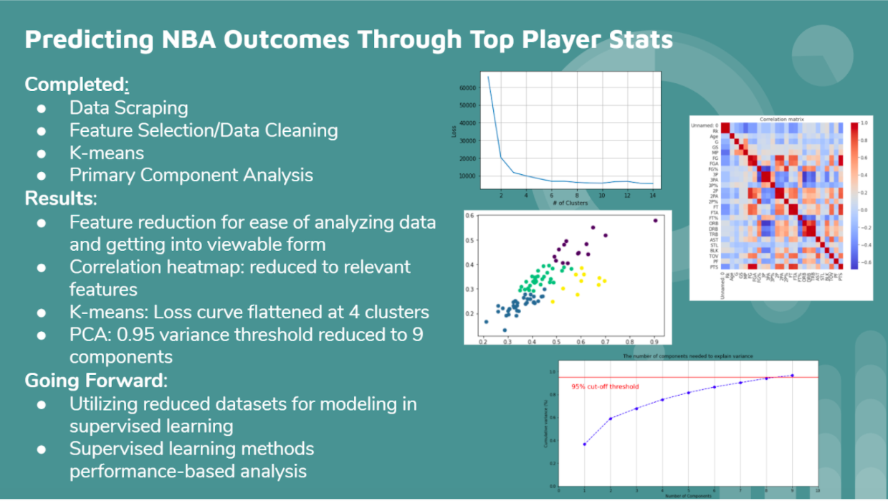

**Team Members: Srinath Dhamodharan, Aiza Aslam, Shelby Crisp, Nealie Glasser**

# Introduction
## Background

Basketball has become one of the most popular sports worldwide. While there are leagues across the world, many athletes train to play in the NBA, where the most elite players compete for a chance at a championship. The success of each team is typically seen to rest on the performance of each team's star players, taking into account their abilities to score, create plays, and defend. While some players are seen better than others and some teams are considered favorites in their games, the outcomes of games are never certain. There are numerous characteristics that determine a team and player's performance and the winner of each game. The goal for this project is to use data from the top three players from each team to determine the results of a game between teams. To do this, we need a usable dataset.

## Data

Our data was initially taken from basketball-reference.com. One dataset included the 2020 overall season schedule, which includes features that list the team names and their scores for each game. The other dataset included the seasonal top 3 players on each NBA team, with features that cover their playing statistics. To see the original season dataset, see 2020_season_sched.csv. To see the original dataset of the top 3 players for each team, see top_3_each_team.csv. This dataset is temporal, as it only consists of a single season’s stats.

## Objective for Unsupervised Learning

Having excess features in data can have a negative impact on model performance. An increase in features increases the size of the dataset being processed, which can affect runtime and allow algorithms to train faster. Redundancy in data stemming from irrelevant features can cause overfitting, where the algorithms will make incorrect decisions. Overall, accuracy will improve with data that has only relevant features. Through the use of unsupervised learning algorithms, we can learn about our dataset and find ways to decrease the number of features to improve performance without negative effects.

# Methods
## Correlation Heatmap

In order to reduce the data to the most relevant features, we created a pearson correlation matrix and heatmap, visualized below.

As shown in the matrix, the diagonal is perfectly correlated as expected, but we noticed some areas where feature reduction could be done, such as how offensive rebounds (ORB), defensive rebounds (DRB) and total rebounds (TRB) all had correlation values of around 0.95, so we decided the data could simply be represented using TRB. This was repeated for other trends like this we noticed from the matrix. The data was then cleaned and formatted in order of each team, and can be seen at season_2020_sched_clean.csv and top_3_each_team_clean.csv. These final datasets consist of 1144 data points and 4 features and 90 data points and 15 features, respectively

## K-Means Clustering

Another way that data could be reduced would be to cluster like data points together and see if the resulting clusters correspond to similar win-loss ratios. By plotting loss over various numbers of clusters, we found that the point at which loss flattens would be at about four clusters. Therefore we used four clusters to represent the data. This can be seen in the visualization below as well as in the coloring for our PCA visualization.

## Primary Component Analysis

Primary component analysis is a good way to reduce features of a dataset. PCA reduces the dimension of a feature space in such a way that the new features are largely independent of each other. Dimensions that are highly correlated can be combined to form a stronger feature. For PCA we chose a .95 target variance for dimensionality. With this threshold, we were able to reduce to 9 components. We were able to plot each component in order to visualize. Our results from k-means were overlaid in the color of each data point.

# Future Work

Our initial goal was to use unsupervised learning to cluster our data and reduce the number of features of our data. At this stage, we are only able to compare performance between different parameter options of these unsupervised algorithms. Here we have optimized based on the given dataset. We will use all reduced datasets when modeling in supervised models and draw conclusions based on their performance at that point. Some future work would be to decide on some improvements to our dataset based off of initial supervised learning results. For example, instead of having the top 3 players’ seasonal averages, it might be beneficial to scrape the data for their stats for each game so they can be directly correlated to each game’s outcome. Once the datasets are finalized, we will move to the supervised learning stage to relate these statistics to the outcome of each game. We will try several supervised learning methods such as neural networks, random forest regression, and SVM. Since the only two outcomes for a game are either a win or a loss, these will be the two classifiers for our classification models we plan on making using supervised learning. 

# References

Bunker, Rory P., and Fadi Thabtah. “A Machine Learning Framework for Sport Result Prediction.” Applied Computing and Informatics, vol. 15, no. 1, 19 Sept. 2017, pp. 27–33., doi:10.1016/j.aci.2017.09.005. 

Fayad, Alexander. “Building My First Machine Learning Model: NBA Prediction Algorithm.” Medium, Towards Data Science, 12 July 2020, towardsdatascience.com/building-my-first-machine-learning-model-nba-prediction-algorithm-dee5c5bc4cc1. 

Goitia, Francisco. “An Attempt to Predict the NBA with a Machine Learning System Written in Python Part II.” Medium, HackerNoon.com, 29 Apr. 2019, medium.com/hackernoon/how-to-predict-the-nba-with-a-machine-learning-system-written-in-python-part-ii-f276b19520b9. 
