**Team Members: Srinath Dhamodharan, Aiza Aslam, Shelby Crisp, Nealie Glasser**

# Introduction
## Background

Basketball has become one of the most popular sports worldwide. While there are leagues across the world, many athletes train to play in the NBA, where the most elite players compete for a chance at a championship. The success of each team is typically seen to rest on the performance of each team's star players, taking into account their abilities to score, create plays, and defend. While some players are seen better than others and some teams are considered favorites in their games, the outcomes of games are never certain. There are numerous characteristics that determine a team and player's performance and the winner of each game. The goal for this project is to use data from the top three players from each team to determine the results of a game between teams. To do this, we need a usable dataset.

## Data

Our data was initially taken from basketball-reference.com. One dataset included the 2020 overall season schedule, which includes features that list the team names and their scores for each game. The other dataset included the seasonal top 3 players on each NBA team, with features that cover their playing statistics. To see the original season dataset, see 2020_season_sched.csv. To see the original dataset of the top 3 players for each team, see top_3_each_team.csv. This dataset is temporal, as it only consists of a single season’s stats.

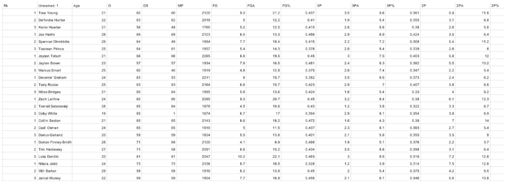

## Objective for Unsupervised Learning

Having excess features in data can have a negative impact on model performance. An increase in features increases the size of the dataset being processed, which can affect runtime and allow algorithms to train faster. Redundancy in data stemming from irrelevant features can cause overfitting, where the algorithms will make incorrect decisions. Overall, accuracy will improve with data that has only relevant features. Through the use of unsupervised learning algorithms, we can learn about our dataset and find ways to decrease the number of features to improve performance without negative effects.

# Methods
## Correlation Heatmap

In order to reduce the data to the most relevant features, we created a pearson correlation matrix and heatmap, visualized below.

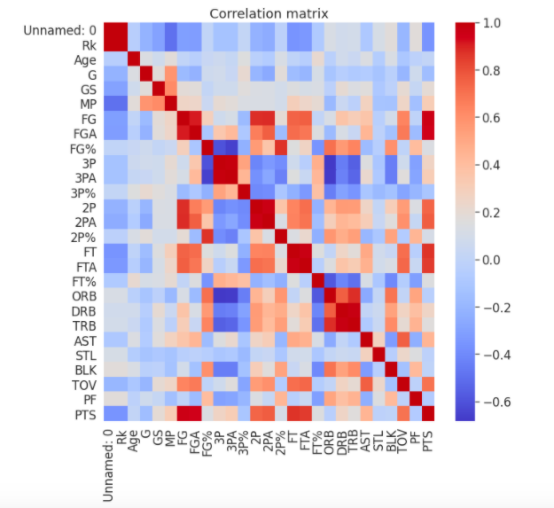

As shown in the matrix, the diagonal is perfectly correlated as expected, but we noticed some areas where feature reduction could be done, such as how offensive rebounds (ORB), defensive rebounds (DRB) and total rebounds (TRB) all had correlation values of around 0.95, so we decided the data could simply be represented using TRB. This was repeated for other trends like this we noticed from the matrix. The data was then cleaned and formatted in order of each team, and can be seen at season_2020_sched_clean.csv and top_3_each_team_clean.csv. These final datasets consist of 1144 data points and 4 features and 90 data points and 15 features, respectively

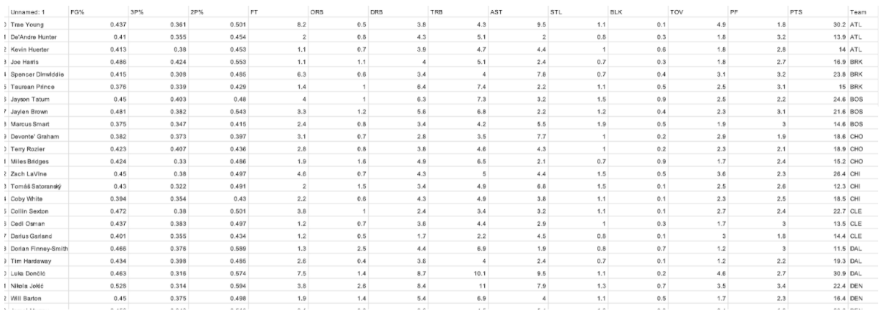

## K-Means Clustering

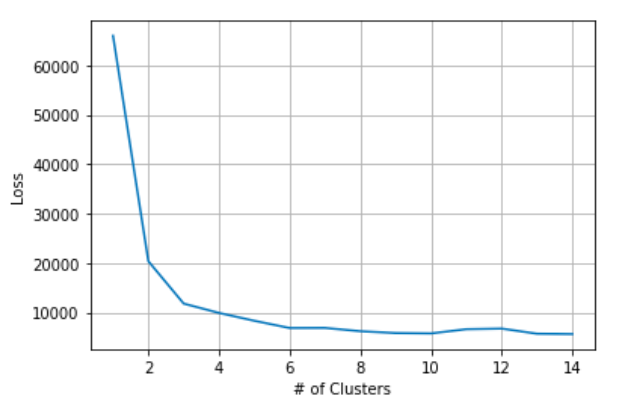

Another way that data could be reduced would be to cluster like data points together and see if the resulting clusters correspond to similar win-loss ratios. By plotting loss over various numbers of clusters, we found that the point at which loss flattens would be at about four clusters. Therefore we used four clusters to represent the data. This can be seen in the visualization below as well as in the coloring for our PCA visualization.

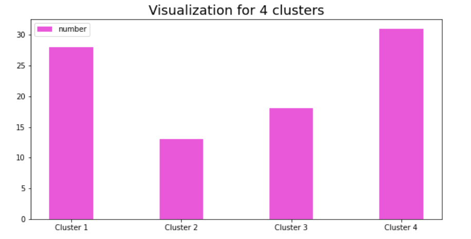

## Primary Component Analysis

Primary component analysis is a good way to reduce features of a dataset. PCA reduces the dimension of a feature space in such a way that the new features are largely independent of each other. Dimensions that are highly correlated can be combined to form a stronger feature. For PCA we chose a .95 target variance for dimensionality. With this threshold, we were able to reduce to 9 components. We were able to plot each component in order to visualize. Our results from k-means were overlaid in the color of each data point.

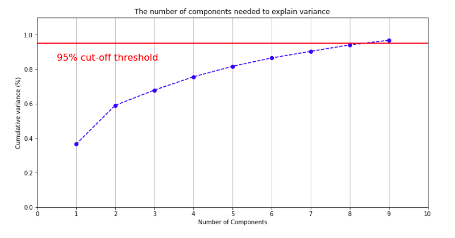

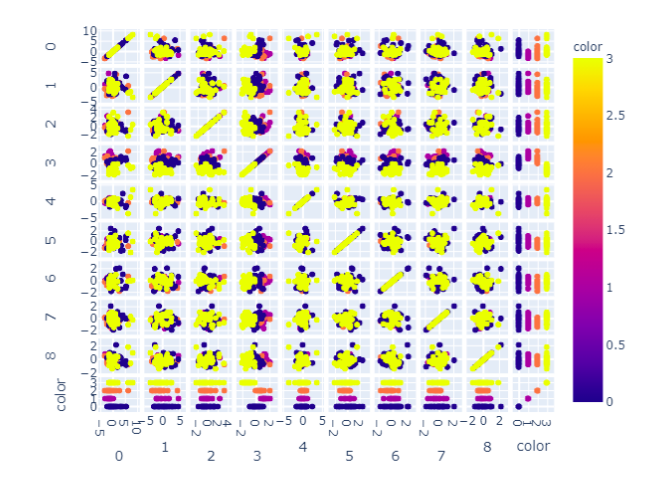

## Objective for Supervised Learning

For the supervised learning portion of our project, we decided to implement a random forest algorithm as well as a neural network. The random forest algorithm was chosen due to how well it performs with smaller datasets. The application of machine learning for sports betting is not novel, and random forest is often implemented as a solution. Because of the effect minimal changes in player stats can have on wins and losses, as well as the complexity of the data and large feature space, we decided to use neural networks as well. Below are our findings, as well as what we would change in future implementations. We used our data after feature selection, as our K-means and PCA implemented data had much lower accuracy in both random forest and neural network.

## Random Forest

Random forest is a classification algorithm. It consists of many decision trees combined. A decision tree is a modelling approach that, like its name suggests, takes a tree like structure in classifying datasets. At each level in a decision tree, the dataset is split based off of a feature into similar subgroups. Random forests consist of many individual decision trees that operate together to form a consensus. This works well, since the failure of one decision tree to properly classify data will not immediately cause failure of the system unless the entire ensemble of trees all come to the same incorrect conclusion.

### Our Implementation

We decided to use k-fold cross validation in our implementation. This is useful in limited data samples, and usually results in less biased models than other methods. 5 was chosen as our k value as it is a common choice for this parameter. Our sample was split into 5 groups which were then used as a test data set with the remaining as training. The model was fit on the training set and then evaluated on the test set. We used random search for hyperparameter selection and tuning. 200 iterations were completed with random combinations of hyperparameters to pick the best model. We ended up with 154 estimators and a max depth of 5. Lastly, we did an analysis of feature importance to look specifically at the most important features. We did not see an obvious need to eliminate any features based on this analysis; however, we experimented with this anyway, eliminating all but the 10 most important features, which actually decreased the accuracy of our results. We used a strip plot to look more closely at the correlation between defensive rebounds (the most important feature) and outcome prediction, and we found a low defensive rebound number for team 2 corresponded with a higher chance of winning for team 1, and vice versa, which is the relationship we would expect to see.

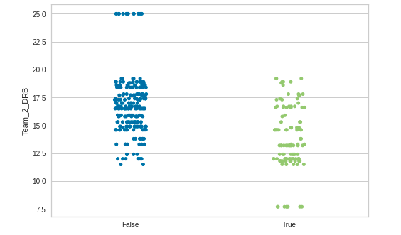

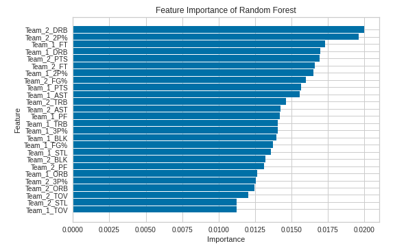

### Comparison

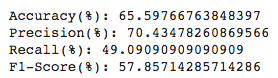

Our random forest implementation didn’t perform all too well. We were only able to achieve a 65.6% accuracy rate. However, our precision wasn’t bad, at 70%. The F1-Score ended up at 58%, which we would like to be closer to 100%. One weakness in our implementation is a lack of data. Since we honed in on one years’ worth of player and game statistics, we didn’t have a lot of data to work with. In future implementations we could go further back in NBA stats. To break even in sports betting, a better must be correct 52.4% of the time. So we technically could make a profit with Random Forest.

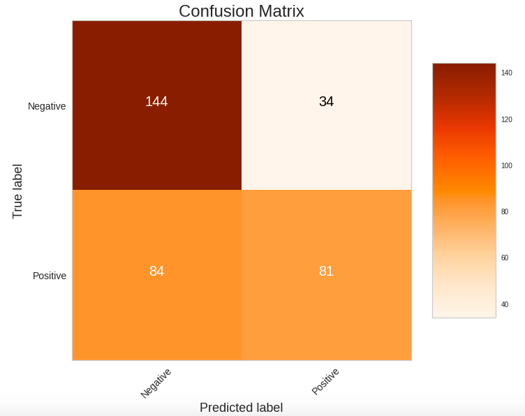

## Neural Networks

A neural network is a learning technique modeled loosely off of the human brain. Like neurons of the brain, a neural network consists of interconnected nodes that process information. Neural nets work by passing data through multiple layers of neurons that transform data towards a goal. Errors that propagate in these transformations are used to better train the neural net. One strength of a neural network is that it can model complex relationships. Since there is a lot of complexity between the average performance of a few players and the performance of their teams, this was a useful characteristic for our algorithm to have.

### Our Implementation

Much like our Random Forest implementation, we again used 5-fold cross validation. We used this algorithm for the aforementioned reasons. To tune hyperparameters for our neural network, we used a grid search as opposed to a random search. This tries every combination from a specified grid of hyperparameters. We used Rectified Linear Unit as our activation function which is simply a piecewise function that outputs the input if it’s positive, otherwise outputting zero. It has the advantage of being more efficient than other activation functions due to its simplicity. We ended up using two hidden layers. Our regularization parameter, alpha, was 5.4.

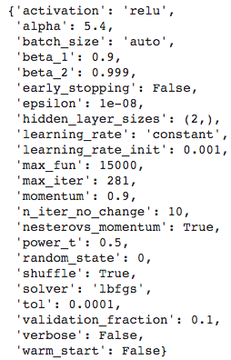

### Comparison
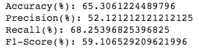

Compared to Random Forest, our neural network didn’t fare any better. It still had an accuracy of around 65%. This is likely due to the fact that we have a small dataset. Our F1 score for the neural net was 59%, which is slightly higher than the score for our Random Forest. However, our precision was a lot lower, at 52%. We still would be able to make a profit in Vegas, however we had hoped for better results. While we weren’t able to get a highly accurate game predictor, it isn’t very surprising. If we could predict something so complex very easily, there would be no fun in watching sports at all.

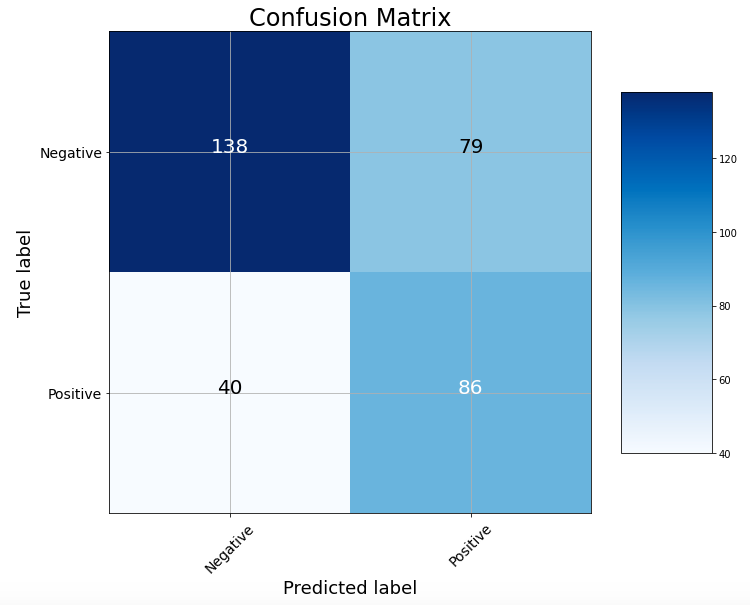

# Conclusion

Would we be able to turn a profit in Vegas? Yes. Since we are able to get above 52.4% accuracy, which is necessary to break even, we would be able to turn a profit. However, in the future we would want to increase our margins further. To do this, we would first increase the size of our dataset by going further back in NBA stats. We could also try a larger variety of algorithms. While the algorithms we chose have been used historically to gauge game results, as well as have strengths that seem to make up for drawbacks in our data, the only way we could know the best algorithm for sure is to test a wider variety. Between Random Forest and Neural Net, we achieved similar F1 scores, with our Neural network implementation scoring slightly better. However, our precision was much lower, meaning our neural network had more false positives. Both were similarly accurate, and could be used interchangeably in that sense. 

# References

Bunker, Rory P., and Fadi Thabtah. “A Machine Learning Framework for Sport Result Prediction.” Applied Computing and Informatics, vol. 15, no. 1, 19 Sept. 2017, pp. 27–33., doi:10.1016/j.aci.2017.09.005. 

Fayad, Alexander. “Building My First Machine Learning Model: NBA Prediction Algorithm.” Medium, Towards Data Science, 12 July 2020, towardsdatascience.com/building-my-first-machine-learning-model-nba-prediction-algorithm-dee5c5bc4cc1. 

Goitia, Francisco. “An Attempt to Predict the NBA with a Machine Learning System Written in Python Part II.” Medium, HackerNoon.com, 29 Apr. 2019, medium.com/hackernoon/how-to-predict-the-nba-with-a-machine-learning-system-written-in-python-part-ii-f276b19520b9. 
